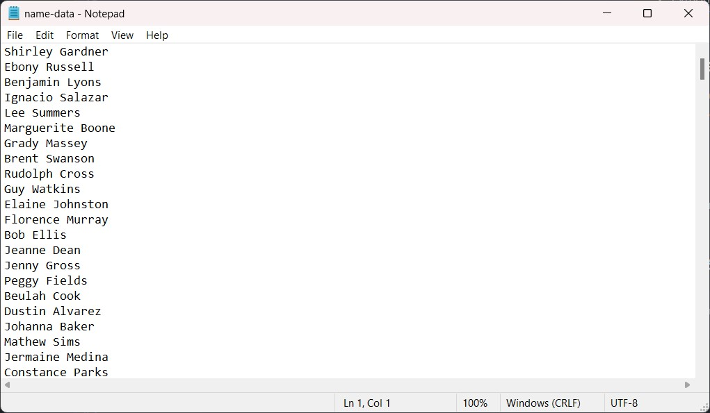
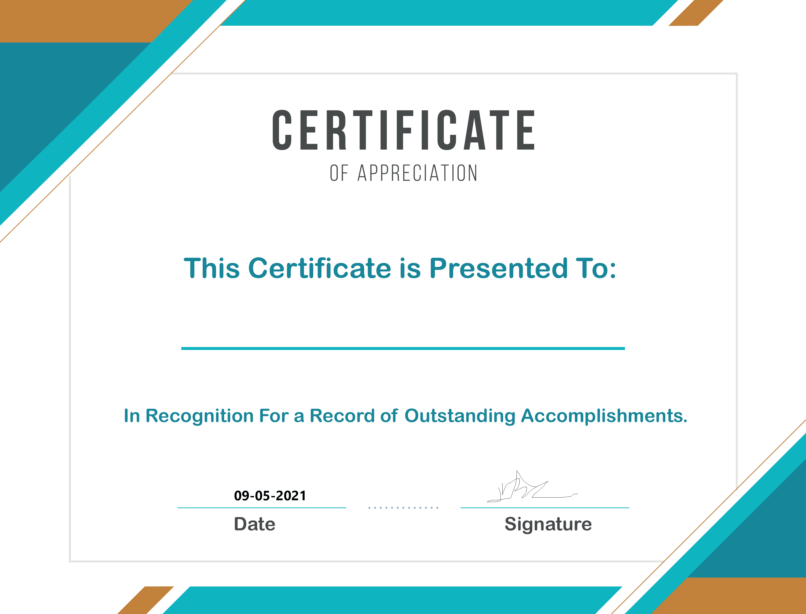
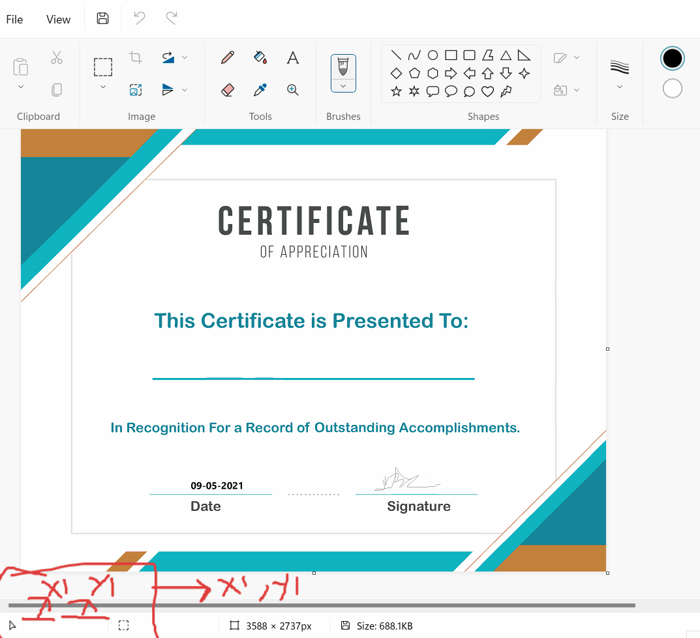

# Automatic Certificate Generator

## Introduction


**Video Tutorial:** https://www.youtube.com/watch?v=Xf8dhNl4d9c&t

In life, automating the boring stuff is the main key to be a productive person. This simple python prototype generates certificates based on the given name list automatically.

The problem that, this simple python script tries to solve is re-entering the name of the certificate holders.

This script uses Python & OpenCV as its main component to perform this task. The logic is pretty simple to understand, It takes a template of a certificate and generates more certificates based on the given name list.

## Technology and Framework

- Python 3.8
- OpenCV


### Why OpenCV?

We use OpenCV to write text on the certificate templates, OpenCV is a popular framework for computer vision.


## How to use it?

**Step 01:** Enter the name list of certificate holders in the "name-data.txt" file.




**Step 02:** Choose a certificate template



**Step 03:** Get the X1, Y1 coordinates, to get the X1, Y1 coordinates, use windows print application that is free and easy. To do that, open the print and load the template in it. An example is shown bellow.



**Note** In the bottom of the paint application, it will show the X1, Y1 coordinates.


**Step 04:** Enter the X1, Y1 coordinates in "run.py" script, to do that open the "run.py" in a text editor and, edit the X1, Y1 coordinates that is found on the code line number of 22.


**Step 05:** Finally, execute the "run.py" script to get the outputs. In the "generated-certificates" folder all the generated certificates will be stored.

```
python run.py

```


#### Generated certificates


#### Sample Certificate


## To execute the program run the following command. 

```
python run.py

```

Any Questions? | Conduct Me
---

* [Linkedin Profile](https://www.linkedin.com/in/gunarakulangunaretnam)
* [Facebook Profile](https://www.facebook.com/gunarakulan)
* [Twitter Profile](https://twitter.com/gunarakulang)
* [Instagram Profile](https://www.instagram.com/gunarakulan_gunaretnam/)
* [Youtube Channel](https://www.youtube.com/channel/UCMWkED5sabgVZSCKjZuRJXA/videos)
